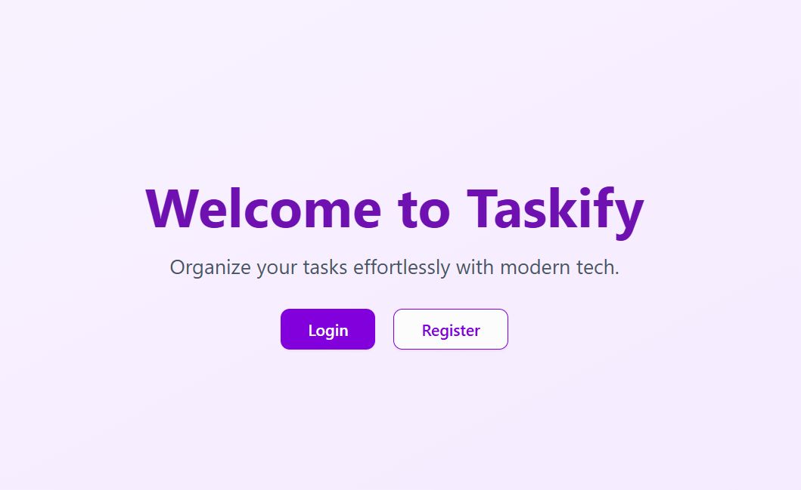
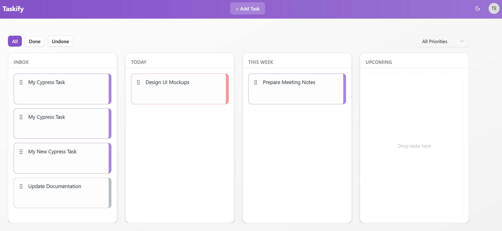
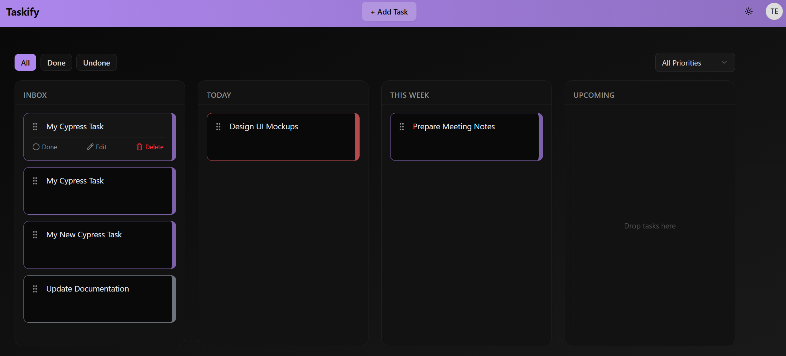

# **Taskify**  
_A modern task management web app with drag & drop, real-time updates, and a sleek UI._

---

## 🌟 Overview  
Taskify is a **full-stack task management platform** designed to be simple, beautiful, and developer-friendly. It brings modern UI patterns, smooth drag-and-drop interactions, and robust backend architecture for a seamless experience. Built with **React + TypeScript** on the frontend and **Node.js (NestJS)** on the backend, Taskify supports **light & dark themes**, **real-time task updates**, and **end-to-end testing** with an isolated test database.

---

## ✅ Features  
- **Modern UI**  
  - Built with [React](https://react.dev), [TypeScript](https://www.typescriptlang.org/), [Tailwind CSS](https://tailwindcss.com/), and [shadcn/ui](https://ui.shadcn.com)  
  - Light/Dark mode toggle  
  - Responsive layout for desktop & mobile  

- **Board & Task Management**  
  - Drag & Drop columns and tasks using **@dnd-kit**  
  - Organize tasks by columns: _Inbox, Today, This Week, Upcoming_  
  - Task priorities (High, Medium, Low)  

- **Authentication**  
  - JWT-based authentication  
  - Secure password hashing  

- **Backend**  
  - **NestJS** framework with **TypeScript**  
  - **PostgreSQL** database managed with **Prisma ORM**  
  - Validation with **class-validator**  

- **Testing & Quality**  
  - **Vitest** + **Testing Library** for unit tests  
  - **Cypress** for end-to-end tests  
  - Dedicated **test database** for clean, isolated test runs  

- **Developer Experience**  
  - Hot Reloading with [Vite](https://vitejs.dev)  
  - Type-safe APIs and models  
  - Structured folder layout  

- **Docker Support**  
  - Full **Docker Compose** setup for backend and PostgreSQL  
  - Easy local development and testing in containers  

---

## 🛠️ Tech Stack  
**Frontend**  
- React 18 + TypeScript  
- Zustand (state management)  
- TanStack Query (data fetching & caching)  
- TailwindCSS + shadcn/ui  

**Backend**  
- Node.js (NestJS)  
- PostgreSQL + Prisma ORM  
- JWT Authentication  
- Class-validator  

**Testing**  
- Unit Testing: Vitest  
- E2E Testing: Cypress (with Dockerized test DB)  

**Infrastructure**  
- Docker & Docker Compose  
- Vite for frontend build  
- ESLint & Prettier for code quality  

---

## 📦 Project Highlights  
- **Drag & Drop** for tasks and boards  
- **Light/Dark Theme** toggle  
- **Responsive & Modern UI**  
- **Full CI-ready** setup (with Docker)  
- **Isolated E2E Testing** with a **test database**  
- **Developer-first experience**: fast builds, type safety, and clean architecture  

---

## 📸 Screenshots (Coming Soon)  





---

## 🚀 Roadmap  
- [x] Phase 1: Frontend UI & Drag and Drop  
- [x] Phase 2: Backend API & Authentication  
- [x] Phase 3: Tests (Unit + E2E)  
- [ ] Phase 4: AI Features (Task Suggestions)  
- [ ] Phase 5: Email Notifications  
- [ ] Phase 6: Multi-user Boards  

---

## 💡 Why Taskify?  
Because task managers should be **beautiful**, **fast**, and **developer-friendly**. Taskify brings everything you need: a smooth UI, strong backend, and a codebase designed for **scalability and maintainability**.

---

## 🏃 How to Run (Frontend & Backend)

# 🏃 How to Run (Frontend & Backend)

## ✅ Prerequisites
```
- Node.js (v18+)
- Docker & Docker Compose
- NPM or Yarn
```

---

## ▶️ Run Frontend
```
# Navigate to frontend folder
cd frontend

# Install dependencies
npm install

# Start development server
npm run dev
```

---

## ▶️ Run Backend
```
# Navigate to backend folder
cd backend

# Ensure Docker is running (for PostgreSQL)
docker compose up -d

# Install dependencies
npm install

# Start backend server
npm run start
```

---

# 🧪 Run End-to-End (E2E) Tests

## Backend E2E Setup
```
# Ensure Docker is running (for test database)
docker compose up -d

# (First time only) Reset test database
npm run db:reset:test

# Start backend in test mode
npm run start:test
```

---

## Frontend E2E Tests
```
# Start development server
npm run dev

# Run Cypress E2E tests
npm run test:e2e
```


---

## 🤝 Contributing  
Contributions are welcome! If you’d like to improve Taskify, feel free to fork the repo and create a PR.

---

## 📜 License  
[MIT](LICENSE)
